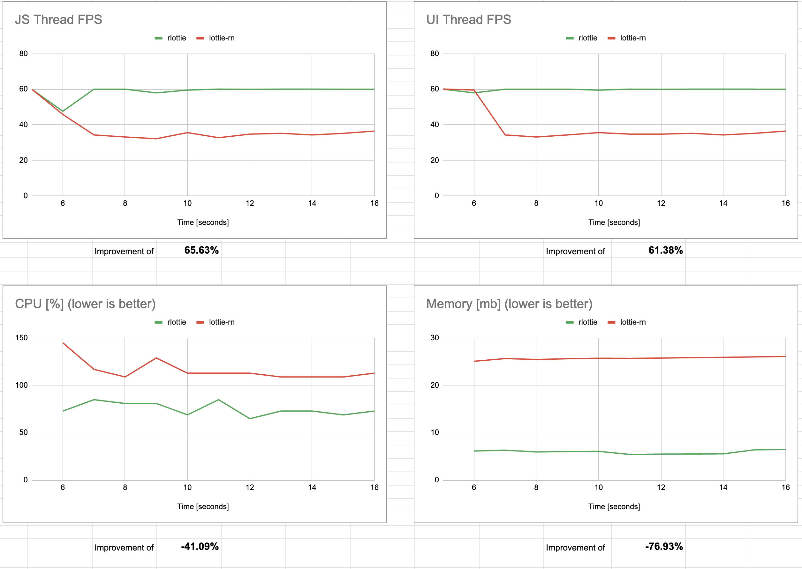

# 🌈 react-native-rlottie

## Features

- ▶️ Uses [rlottie](https://github.com/Samsung/rlottie) to run lottie animations
- 🌠 rlottie creates rasterized bitmaps for each frame of the animation (instead of using the platform's animation API to continuisly run the animation).
    - This also gives us the possibility to pre-render the animation into cache, so even complex animation can start and run in 60 FPS
-  ✅ Compatible with the new architecture (Fabric)
- 🤖 Especially on android, using rlottie can be more performant than [lottie-android](https://github.com/airbnb/lottie-android) (which is used by [lottie-react-native](https://github.com/lottie-react-native/lottie-react-native)):
  - 📉 Using less CPU and RAM
  - 🏃‍♂️ Puts less pressure on the UI/main Thread, ensuring 60 FPS even on low end devices
  - Read more in [Performance Comparison](#performance-comparison)

## Usage

We try to be as close to the [lottie-react-native](https://github.com/lottie-react-native/lottie-react-native) implementation API, so you can use this library as drop-in replacement/complement.

So loading a local animation really is the same:

```jsx
import React from 'react';
import {View} from 'react-native';
import RLottieView from 'react-native-rlottie';

const lottieAnim = require('./assets/icon_trophy.json');

const App = () => {
  return (
    <View>
      <RLottieView source={lottieAnim} style={styles.animation} />
    </View>
  );
};

const styles = StyleSheet.create({
  animation: {
    height: 700,
    width: 700,
  },
});

export default App;
```

## Performance Comparison

All data for the comparison can be found here: https://docs.google.com/spreadsheets/d/1Akz2As7HSJ7n9kmpIMYG966GY4QybOkJth5nNewYZhs/edit?usp=sharing

We compared react-native-rlottie with lottie-react-native:


### 🤖 Android 



#### Key observations

- Running the animation consumes less CPU (-76%) and memory (-41%).
- The animation runs fluently in 60 FPS, whereas lottie-android causes the FPS to drop.
  - This is due to the fact that the animation used for testing is a "complex" one, and running the animation with the platform's animated/art API is more expensive then to render the animation as bitmaps.

### 🍎 iOS

```
// TODO: Comparison for ios
```

#### Key observations

- Running the animation with lottie-react-native adds CPU pressure. Using the example with an iPhone 7+ there is a ~10% CPU pressure during running the animation with lottie-rn, whereas with rlottie its 0%

### Overall key points

- Constantly running an animation with rlottie is in general more resource-saving, thus it can ensure more stable FPS, specially on low end devices.
- **HOWEVER**, the first time you render the animation rlottie will use _more_ resources than lottie-rn, as it needs to decode all frames for the first time. For large and complex animations this can be a severe factor. That's why, especially on iOS, its recommanded to pre-load an animation.
- In general, you should check the performance implications for each animation you are using, and test yourself if you are getting better results with lottie-rn or rlottie.

_Note:_ The performance results have been recorded with [react-native-performance-stats](https://github.com/skillnation/react-native-performance-stats).

### How to test yourself 

<details>
    <summary>Click to expand:</summary>

- Setup the example app on your machine
- You might want to replace the animation to test with your own. Simply replace the file `example/assets/icon_trophy.json`
- First, open the "Performance test: RLottie" screen in the example app and press start.
- Wait ~20 seconds until an array is printed to your console output
- Copy that data to a online service that convert JSON data in CSV: https://www.convertcsv.com/json-to-csv.htm
- Copy the resulting table and paste the data in a copy of the benchmark google sheet named earlier
- Repeat the same with the lottie-react-native screen
</details>

## Installation

```bash
yarn add react-native-rlottie

npm i react-native-rlottie
```

### iOS

Run pod install:

```bash
npx pod-install
```

### Android

No additional steps for android are required, except when using the new react native architecture:

<details>
    <summary>Click to expand for the instructions:</summary>

(_Note:_ This setup is required to to the fact that the on android Autolinking doesn't work with the new architecture out of the box. This procedure will change in the future.)

1. Open `android/app/build.gradle` file and update the file as it follows:
    ```diff
    defaultConfig {
        ...
        "PROJECT_BUILD_DIR=$buildDir",
        "REACT_ANDROID_DIR=$rootDir/../node_modules/react-native/ReactAndroid",
    -   "REACT_ANDROID_BUILD_DIR=$rootDir/../node_modules/react-native/ReactAndroid/build"
    +   "REACT_ANDROID_BUILD_DIR=$rootDir/../node_modules/react-native/ReactAndroid/build",
    +   "NODE_MODULES_DIR=$rootDir/../node_modules/"
        cFlags "-Wall", "-Werror", "-fexceptions", "-frtti", "-DWITH_INSPECTOR=1"
        cppFlags "-std=c++17"
    ```
1. Open the `android/app/src/main/jni/Android.mk` file and update the file as it follows:
    ```diff
        # If you wish to add a custom TurboModule or Fabric component in your app you
        # will have to include the following autogenerated makefile.
        # include $(GENERATED_SRC_DIR)/codegen/jni/Android.mk
    +
    +   # Includes the MK file for `react-native-rlottie`
    +   include $(NODE_MODULES_DIR)/react-native-rlottie/android/build/generated/source/codegen/jni/Android.mk
    +
        include $(CLEAR_VARS)
    ```
1. In the same file above, go to the `LOCAL_SHARED_LIBRARIES` setting and add the following line:
    ```diff
        libreact_codegen_rncore \
    +   libreact_codegen_rlottieview \
        libreact_debug \
    ```
1. Open the `android/app/src/main/jni/MainComponentsRegistry.cpp` file and update the file as it follows:
    1. Add the import for the RLottieView:
        ```diff
            #include <react/renderer/components/answersolver/ComponentDescriptors.h>
        +   #include <react/renderer/components/rlottieview/ComponentDescriptors.h>
            #include <react/renderer/components/rncore/ComponentDescriptors.h>
        ```
    1. Add the following check in the `sharedProviderRegistry` constructor:
        ```diff
            auto providerRegistry = CoreComponentsRegistry::sharedProviderRegistry();

            // Custom Fabric Components go here. You can register custom
            // components coming from your App or from 3rd party libraries here.
            //
            // providerRegistry->add(concreteComponentDescriptorProvider<
            //        AocViewerComponentDescriptor>());
        +   providerRegistry->add(concreteComponentDescriptorProvider<RLottieViewComponentDescriptor>());

            return providerRegistry;
        }
        ```
</details>    

## Supported After Effects Features

This has full feature parity with rlottie, so check their [supported features here](https://github.com/Samsung/rlottie#supported-after-effects-features)
 
## Caveats
    
In our testing, on iOS, there is a blocking of the UI thread and it takes some time until the animation is ready (for our most complex animation its 2s!).
On iOS we are still missing some of the optimziation that we have already on android such as async/threaded frame decoding on the fly.
Once we add those features we believe the performance can be similar to android. However, more development/research is needed.
If you are an iOS dev, we welcome you to take on the challenge and improve or provide wisdom 🙌

## Development
    
We are open for and welcoming contribution of any kind!

To develop this library use the `example/`. Simply install the dependencies in the root dir
with `yarn` and then install the dependencies in the `example/`.

As this library is compatible with the old and the new arch, it can be useful to check both versions during development.

### 🤖 Switching arch:

In `example/android/gradle.properties` you can simply toggle the `newArchEnabled` variable.

### 🍎 Switching arch:

Go into `example/ios` and run the following command setting `RCT_NEW_ARCH_ENABLED` to `1` or `0` depending on which arch you want to test:

```bash
cd ios && RCT_NEW_ARCH_ENABLED=1 pod install && cd ..
```

## References / Used libraries / Thanks

- https://github.com/Aghajari/AXrLottie - Used for android implementation, does all the heavy lifting, thx <3
- https://github.com/SDWebImage/librlottie-Xcode - Providing rlottie as cocoapods package, ready to be consumed by XCode, thx <3
